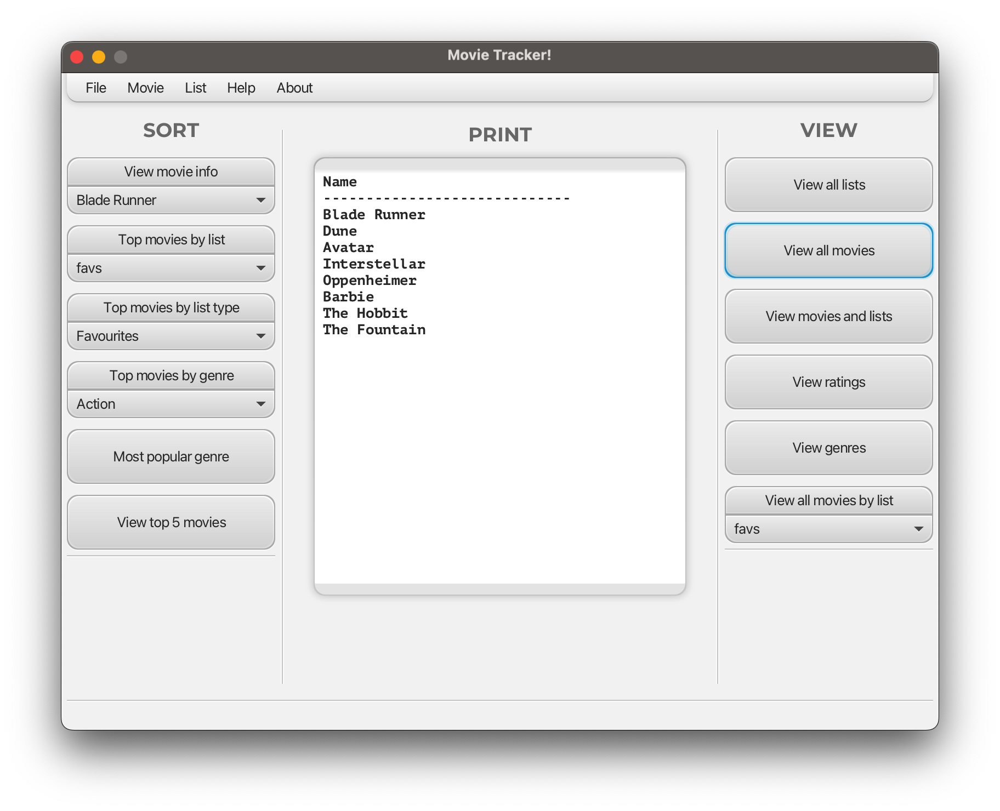

# Computer Science 219 Movie Tracker Project
* Authors: Faris Salhi, Ariel Motsi
* Course: CPSC 219, Fall 2023
* Instructor: Dr. Jonathan Hudson
* Tutorial T06

  

## About Movie Tracker
This program is a project where we used Java and Javafx to create an app where a user can store and keep track of different movies they have watched, want-to-watch and their favourites. The app also allows the user to view different types of data about the movies they have stored by using the GUI interface's buttons and options. Running the program allows the user to create lists, specify list name and type; add movies, specify movie name, list, genre, and rating; view all data; view sorted data.

## How to run
### Without .jar file
You can run the application using the IDE or with this command in the target/classes folder:  
java --module-path "path to javafx library" --add-modules javafx.controls,javafx.fxml movietracker.core.MainGUI  
You can add command-line arguments by specifying the name of the data file to be loaded after the command above (file must be .txt or .csv in the classes folder).  
Or in an IDE, add command-line arguments by editing configurations to recieve .txt/.csv data file stored in the MovieTracker main directory.

### With .jar file
Run it through the jar file in the out/artifacts/MovieTracker folder:  
java --module-path "path to javafx library" --add-modules javafx.controls,javafx.fxml -jar MovieTracker.jar movietracker.core.MainGUI  

## Menu Bar Functions
* Create and delete different lists that movies will be stored in.
* Add movies by adding the name of the movie, a rating, a genre and the list it will be added to.
* Added movies can be deleted by selecting the movie name in the Delete option of the Movie menu option.
* Movies and lists can be loaded from a .txt or .csv file of the user's choice.
* The user can also save the movies and lists they have created in a .txt/.csv file with a name of their choice (Save-As option) or a default 'save.txt' name (save.txt must exist first in the MovieTracker main directory).
* A brief guide on what the app does and where to find certain features is in the Help menu option.
* Access the About in the menu to find details about the authors and program version.

## View Functions (right side)
* View all lists: All the current lists can be viewed in unsorted order.
* View all movies: All the current movies can be viewed in unsorted order.
* View movies and lists: All the movies and the lists they are in can be viewed in unsorted order.
* View ratings: All the movies and their assigned ratings can be viewed in unsorted order.
* View genres: All the movies and their assigned genres can be viewed in unsorted order.
* View movies by list: All the movies in a selected list can be viewed in unsorted order.

## Sort Functions (left side) 
* View movie info: The selected movie's info (movie name, rating, genre, movie number, list) can be viewed.
* Top movies by list: The top 5 movies in a specific list can be viewed.
* Top movies by list type: The top 5 movies in a specific list type (Favourites, Watched, Want-to-watch) can be viewed.
* Top movied by genre: The top 5 movies in a specific genre can be viewed.
* Most popular genre: The genre with the most movies associated with it can be viewed.
* View top 5 movies: The top 5 movies in any list, list type, or genre can be viewed.

## Print (middle window)
* This is the area where the output of each function will show.

## Status (bottom window)
* The status will display the success or failure messages as the program runs and different functions are called.

## How to set up this Movie Tracker
1. Clone/Pull the project to have a copy you can run on your device
2. Look for the MainGUI.java class (src/main/java/movietracker.core/MainGUI) and run it
3. A window should come up with the GUI that you can interact with
